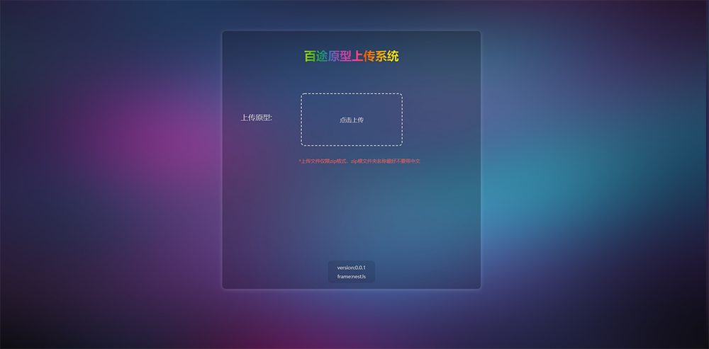
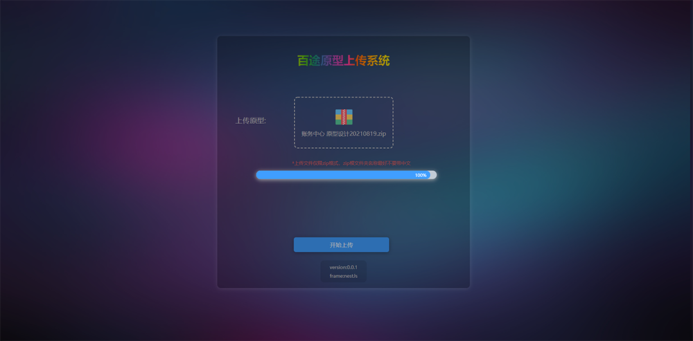
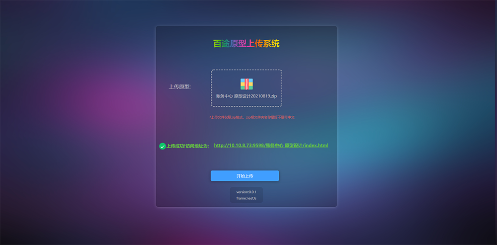

## 百途上传文件系统

### 用于百途产品经理上传zip原型文件到服务器，并解压在指定nginx服务下用于访问。开发人员再也不用接收产品经理的巨大的原型文件包进行预览（每次产品经理改点啥都要重新发一下巨大的完整的原型包，着实难受）

> developer: mafengyan
>
> time:2021-08-20

### 项目截图








**####** 本地启动

```bash
git clone xxx

cd uploadzip

npm install

npm run start:dev
```


**####** 线上启动

```bash
pm2 start dist/main.js
```


#### 代码工作流程

1.设置nginx配置文件，地址指向静态访问文件夹A

2.产品经理访问pc端页面进行上传zip原型

3.进行zip流文件接收存储于文件夹A

4.进行解压zip，并生成文件于文件夹A下

5.判断上传的zip内文件夹路径，通过接口返回原型访问页面路径

6.developer们根据返回的页面路径访问原型index.html


##### 涉及技术栈
1.nestJs
2.adm-zip
3.iconv-lite
4.原生js以及亿点点css3